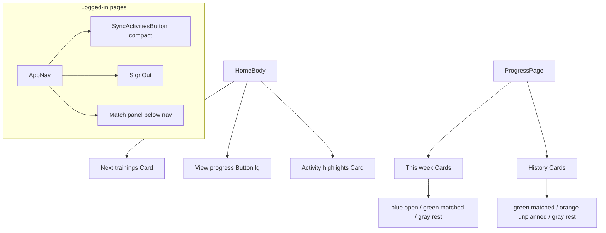

# Homepage & Progress UI Revamp

> **For agentic workers:** Use superpowers:subagent-driven-development or superpowers:executing-plans. On execution, also save a copy to `docs/superpowers/plans/2026-08-10-homepage-progress-ui-revamp.md`.

**Goal:** Move Sync/Sign Out into a logged-in-only top nav, cardify the homepage and progress lists, enlarge View progress, and color-code progress session states.

**Architecture:** Shared client `AppNav` on home + progress hosts compact Sync + Sign Out; match/confirm UI expands below the nav. Homepage body is Next-trainings Card → large View progress button → Activity-highlights Card. Progress rows become Cards with semantic `colorPalette` accents + badges (blue open, green matched, orange unplanned, gray rest).

**Tech Stack:** Next.js App Router, Chakra UI v3 (`Card`, `Badge`, `Button`), existing auth/`SyncActivitiesButton` flow.

**Global constraints:**
- Logged-in nav only (choice A); signed-out welcome unchanged
- Homepage cards: Next trainings + Activity highlights; View progress is a full-width primary button, not its own card
- Progress colors: open=blue, matched=green, unplanned=orange, rest=gray
- No data/service/model changes; no session-plan detail redesign; onboarding unchanged
- Prefer Chakra `Card.Root` / `Card.Body` / `Card.Header` / `Badge` (v3 compound components)
- No new component test harness (repo tests are service-only); verify with `npx tsc --noEmit` + manual UI checks
- Do not commit unless the user asks

---

## File map

| File | Role |
|------|------|
| Create [`src/components/AppNav.tsx`](src/components/AppNav.tsx) | Logged-in top bar: home link + Sync + Sign Out; sync panel below |
| Modify [`src/components/SyncActivitiesButton.tsx`](src/components/SyncActivitiesButton.tsx) | Add `compact` prop for nav sizing; keep match panel under control |
| Modify [`src/app/page.tsx`](src/app/page.tsx) | Wire AppNav; remove body Sync/Sign Out; layout cards + CTA |
| Modify [`src/components/NextSessionsPlan.tsx`](src/components/NextSessionsPlan.tsx) | Card wrap; replace `ProgressLink` with button CTA |
| Modify [`src/components/ActivityHighlights.tsx`](src/components/ActivityHighlights.tsx) | Card wrap |
| Modify [`src/app/progress/page.tsx`](src/app/progress/page.tsx) | AppNav; drop `← Home` |
| Modify [`src/components/progress/ProgressSessionRow.tsx`](src/components/progress/ProgressSessionRow.tsx) | Card + status badge/accent per state |
| Touch [`ProgressThisWeek.tsx`](src/components/progress/ProgressThisWeek.tsx) / [`ProgressHistory.tsx`](src/components/progress/ProgressHistory.tsx) only if spacing needs tweak for card gaps |



---

### Task 1: Compact Sync + AppNav

**Files:**
- Modify: `src/components/SyncActivitiesButton.tsx`
- Create: `src/components/AppNav.tsx`

**Steps:**
- [ ] Add optional `compact?: boolean` to `SyncActivitiesButton`. When `compact`, Sync button uses `size="sm"` and `width="auto"` (not full-width); match/retry/error/message UI still renders in the same `VStack` below the button.
- [ ] Create client `AppNav` accepting `{ userName?: string | null }`:
  - Outer `VStack` full width
  - Top row: `HStack` justify space-between — left `Link` to `/` with app label or first name; right `HStack` with `<SyncActivitiesButton compact />` + Sign Out form (`size="sm"`, `variant="outline"`, `colorPalette="red"`)
  - Sign Out uses the same server action pattern as today (`signOut` from `@/auth`) — either pass a server action prop from pages or keep a tiny form with inline server action in a server wrapper. Prefer: `AppNav` is client and receives `signOutAction` as a prop typed `() => Promise<void>`, defined in each server page with `"use server"`.
- [ ] Manual: sync button still opens match panel below the bar (not cramped into the slim row).

---

### Task 2: Homepage reorganization

**Files:**
- Modify: `src/app/page.tsx`
- Modify: `src/components/NextSessionsPlan.tsx`
- Modify: `src/components/ActivityHighlights.tsx`

**Steps:**
- [ ] Wrap `NextSessionsPlan` content in `Card.Root` + `Card.Body` (header title via `Card.Header` / `Heading` or `Card.Title` “Next trainings”). Keep link-to-plan behavior when `plan` exists; empty state stays inside the card.
- [ ] Replace `ProgressLink` text with:

```tsx
export function ProgressLink() {
  return (
    <Link href="/progress" style={{ textDecoration: "none", width: "100%" }}>
      <Button colorPalette="orange" size="lg" width="full">
        View progress
      </Button>
    </Link>
  );
}
```

- [ ] Wrap `ActivityHighlights` in `Card.Root` + `Card.Body` the same way.
- [ ] Logged-in `page.tsx` structure:

```
Container
  AppNav (userName)
  VStack: NextSessionsPlan → ProgressLink → ActivityHighlights? → OnboardingModal
```

Remove body Sync + Sign Out `VStack`. Drop centered “Logged in as …” heading (nav carries identity). Signed-out branch unchanged.
- [ ] Verify: `npx tsc --noEmit`

---

### Task 3: Progress page + colored session cards

**Files:**
- Modify: `src/app/progress/page.tsx`
- Modify: `src/components/progress/ProgressSessionRow.tsx`
- Optionally spacing: `ProgressThisWeek.tsx`, `ProgressHistory.tsx`

**Steps:**
- [ ] Progress page: add `AppNav` (need session user name from `auth()`); remove `← Home` link; keep title/subtitle.
- [ ] Add a small helper in `ProgressSessionRow.tsx` (or colocated):

```ts
type StatusVisual = {
  colorPalette: "blue" | "green" | "orange" | "gray";
  label: string;
};

// open non-rest → blue / Upcoming
// matched non-rest → green / Done
// rest → gray / Rest
// unplanned → orange / Unplanned
```

- [ ] Rewrite each row component to render `Card.Root` with `colorPalette={...}`, left border accent (`borderLeftWidth="4px"`, `borderLeftColor="colorPalette.solid"` or Chakra token equivalent), `Card.Body`, title line, and `Badge` with the status label. Preserve existing Planned/Actual/purpose content.
- [ ] Apply to: `ProgressSessionRow`, `ProgressMatchedHistoryRow`, `ProgressUnplannedHistoryRow`.
- [ ] Bump list `gap` to ~3 if cards feel tight.
- [ ] Verify: `npx tsc --noEmit`
- [ ] Manual checklist: signed-out home; logged-in home (nav + cards + large CTA); sync match under nav on home and progress; progress open/matched/rest/unplanned colors.

---

## Spec coverage (self-review)

| Requirement | Task |
|-------------|------|
| Sync + Sign Out in top nav (logged-in only) | 1–2 |
| Signed-out unchanged | 2 |
| Cards: Next trainings + highlights | 2 |
| Large View progress button | 2 |
| Progress cards + semantic colors | 3 |
| Match panel below nav | 1 |
| No backend changes | all |
