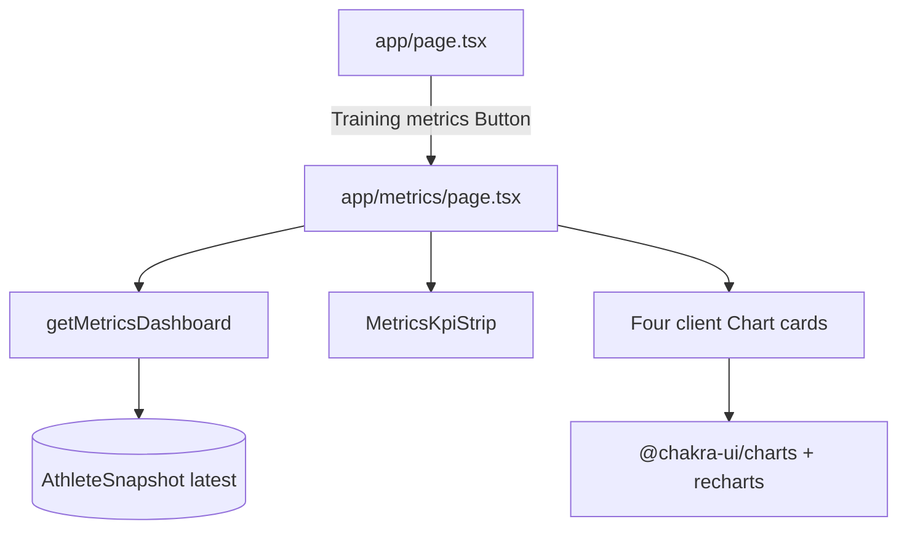

# Metrics Dashboard Implementation Plan

> **For agentic workers:** REQUIRED SUB-SKILL: Use superpowers:subagent-driven-development (recommended) or superpowers:executing-plans to implement this plan task-by-task. Steps use checkbox (`- [ ]`) syntax for tracking.

**Goal:** Add a mobile-first `/metrics` screen (KPI strip + four Chakra/Recharts charts from the latest AthleteSnapshot) and a home CTA to open it.

**Architecture:** Server page loads the latest snapshot via `getMetricsDashboard`, maps it to a serializable DTO, and passes weeks/KPIs into client chart components built with `@chakra-ui/charts` (`useChart` + `Chart.Root`) and Recharts. No live Activity aggregation; Sync stays in `AppNav`.

**Tech Stack:** Next.js App Router, Chakra UI v3, `@chakra-ui/charts`, `recharts`, Mongoose `AthleteSnapshot`, `node:assert/strict` + `npx tsx` colocated tests.

## Global Constraints

- Spec: `docs/superpowers/specs/2026-08-10-metrics-dashboard-design.md`
- Data: latest `AthleteSnapshot` only; empty state when none
- Charts: weekly volume (bar), consistency/runs (bar), long run (line), pace trend (line, reversed Y, `formatPace` for ticks/tooltips)
- Layout: `Container maxW="md"`; KPI `SimpleGrid columns={2}`; stacked chart cards ~200–240px tall
- Install `@chakra-ui/charts` and `recharts`; use Recharts `responsive` (not `ResponsiveContainer`)
- Reuse `formatPace` / `formatDistanceKm` from `src/lib/activityFormat.ts`
- Service tests only; verify UI with `npx tsc --noEmit` + manual mobile check
- Do not commit unless the user asks

---

## File map

| File | Responsibility |
| --- | --- |
| `package.json` / lockfile | Add `@chakra-ui/charts`, `recharts` |
| `src/services/metrics/types.ts` | Dashboard DTO types |
| `src/services/metrics/getMetricsDashboard.ts` | DB load + pure mapper |
| `src/services/metrics/getMetricsDashboard.test.ts` | Mapper empty + happy path |
| `src/components/metrics/MetricsKpiStrip.tsx` | 2×2 KPI grid |
| `src/components/metrics/MetricsEmptyState.tsx` | No-snapshot copy |
| `src/components/metrics/WeeklyVolumeChart.tsx` | Client bar chart |
| `src/components/metrics/ConsistencyChart.tsx` | Client bar chart |
| `src/components/metrics/LongRunChart.tsx` | Client line chart |
| `src/components/metrics/PaceTrendChart.tsx` | Client line chart + pace format |
| `src/app/metrics/page.tsx` | Auth, fetch, compose |
| `src/app/page.tsx` | Training metrics button → `/metrics` |



---

### Task 1: Install chart dependencies

**Files:**
- Modify: `package.json` (via npm)
- Modify: lockfile

**Interfaces:**
- Produces: packages importable as `@chakra-ui/charts` and `recharts`

- [ ] **Step 1: Install packages**

```bash
npm i @chakra-ui/charts recharts
```

Expected: install succeeds; `package.json` lists both deps.

- [ ] **Step 2: Sanity-check imports resolve**

```bash
node -e "require('@chakra-ui/charts'); require('recharts'); console.log('ok')"
```

Expected: prints `ok` (CJS require may differ for ESM-only packages — if it fails, instead confirm entries exist under `node_modules/@chakra-ui/charts` and `node_modules/recharts`).

---

### Task 2: Metrics DTO types + pure mapper + tests

**Files:**
- Create: `src/services/metrics/types.ts`
- Create: `src/services/metrics/getMetricsDashboard.ts`
- Create: `src/services/metrics/getMetricsDashboard.test.ts`

**Interfaces:**
- Produces:
  - Types in `types.ts` (see Step 1)
  - `mapAthleteSnapshotToMetricsDashboard(snapshot: LeanSnapshot | null): MetricsDashboard`
  - `getMetricsDashboard(userId): Promise<MetricsDashboard>` (thin DB wrapper; tested via mapper)
- Consumes: `AthleteSnapshot` model, `dbConnect`, `IAthleteSnapshot` / lean shape

- [ ] **Step 1: Write types**

```ts
// src/services/metrics/types.ts
export type PaceTrend = "improving" | "stable" | "declining";

export type MetricsKpis = {
  currentWeekVolumeKm: number;
  averageRunsPerWeek4w: number;
  currentLongestKm: number;
  paceTrend: PaceTrend | null;
};

export type MetricsWeekPoint = {
  weekStart: string;
  label: string;
  distanceKm: number;
  runs: number;
  longestRunKm: number;
  averagePaceSecondsPerKm: number | null;
};

export type MetricsDashboardEmpty = {
  empty: true;
};

export type MetricsDashboardData = {
  empty: false;
  generatedAt: string;
  kpis: MetricsKpis;
  weeks: MetricsWeekPoint[];
};

export type MetricsDashboard = MetricsDashboardEmpty | MetricsDashboardData;
```

- [ ] **Step 2: Write the failing mapper tests**

```ts
// src/services/metrics/getMetricsDashboard.test.ts
import assert from "node:assert/strict";
import { mapAthleteSnapshotToMetricsDashboard } from "./getMetricsDashboard";

function testNullSnapshotIsEmpty() {
  assert.deepEqual(mapAthleteSnapshotToMetricsDashboard(null), { empty: true });
}

function testMapsKpisAndWeeks() {
  const snapshot = {
    generatedAt: new Date("2026-08-10T12:00:00.000Z"),
    recentTraining: {
      weeks: [
        {
          weekStart: new Date("2026-06-02T00:00:00.000Z"),
          runs: 0,
          distanceKm: 0,
          durationSeconds: 0,
          longestRunKm: 0,
          activitiesWithHeartRate: 0,
          elevationGainMeters: 0,
          walkCount: 0,
          walkDistanceKm: 0,
        },
        {
          weekStart: new Date("2026-06-09T00:00:00.000Z"),
          runs: 3,
          distanceKm: 25.5,
          durationSeconds: 9000,
          longestRunKm: 12,
          averagePaceSecondsPerKm: 330,
          activitiesWithHeartRate: 2,
          elevationGainMeters: 100,
          walkCount: 0,
          walkDistanceKm: 0,
        },
      ],
    },
    currentState: {
      weeklyVolumeKm: { average12w: 20, average4w: 22, currentWeek: 8.5 },
      frequency: { averageRunsPerWeek12w: 3, averageRunsPerWeek4w: 3.5 },
      longRun: { currentLongestKm: 14, averageKm12w: 11 },
      consistency: { weeksWithAtLeast3Runs: 8, totalWeeks: 12 },
      trends: { volume: "increasing" as const, pace: "improving" as const },
      heartRateCoverage: 0.5,
    },
  };

  const result = mapAthleteSnapshotToMetricsDashboard(snapshot);
  assert.equal(result.empty, false);
  if (result.empty) return;

  assert.equal(result.generatedAt, "2026-08-10T12:00:00.000Z");
  assert.deepEqual(result.kpis, {
    currentWeekVolumeKm: 8.5,
    averageRunsPerWeek4w: 3.5,
    currentLongestKm: 14,
    paceTrend: "improving",
  });
  assert.equal(result.weeks.length, 2);
  assert.equal(result.weeks[0]!.distanceKm, 0);
  assert.equal(result.weeks[0]!.averagePaceSecondsPerKm, null);
  assert.equal(result.weeks[1]!.runs, 3);
  assert.equal(result.weeks[1]!.averagePaceSecondsPerKm, 330);
  assert.equal(result.weeks[1]!.label.includes("/"), true);
}

function testMissingPaceTrendIsNull() {
  const snapshot = {
    generatedAt: new Date("2026-08-10T12:00:00.000Z"),
    recentTraining: { weeks: [] },
    currentState: {
      weeklyVolumeKm: { average12w: 0, average4w: 0, currentWeek: 0 },
      frequency: { averageRunsPerWeek12w: 0, averageRunsPerWeek4w: 0 },
      longRun: { currentLongestKm: 0, averageKm12w: 0 },
      consistency: { weeksWithAtLeast3Runs: 0, totalWeeks: 12 },
      trends: { volume: "stable" as const },
      heartRateCoverage: 0,
    },
  };
  const result = mapAthleteSnapshotToMetricsDashboard(snapshot);
  assert.equal(result.empty, false);
  if (result.empty) return;
  assert.equal(result.kpis.paceTrend, null);
}

testNullSnapshotIsEmpty();
testMapsKpisAndWeeks();
testMissingPaceTrendIsNull();
console.log("getMetricsDashboard tests passed");
```

- [ ] **Step 3: Run tests — expect FAIL**

```bash
npx tsx src/services/metrics/getMetricsDashboard.test.ts
```

Expected: FAIL (module / export missing).

- [ ] **Step 4: Implement mapper + DB wrapper**

```ts
// src/services/metrics/getMetricsDashboard.ts
import { dbConnect } from "@/lib/db";
import { AthleteSnapshot, type IAthleteSnapshot } from "@/models";
import type { Types } from "mongoose";
import type { MetricsDashboard, MetricsWeekPoint } from "./types";

export type MetricsSnapshotInput = Pick<
  IAthleteSnapshot,
  "generatedAt" | "recentTraining" | "currentState"
>;

function weekLabel(weekStart: Date): string {
  const month = weekStart.getUTCMonth() + 1;
  const day = weekStart.getUTCDate();
  return `${month}/${day}`;
}

export function mapAthleteSnapshotToMetricsDashboard(
  snapshot: MetricsSnapshotInput | null,
): MetricsDashboard {
  if (!snapshot) return { empty: true };

  const weeks: MetricsWeekPoint[] = snapshot.recentTraining.weeks.map((week) => ({
    weekStart: week.weekStart.toISOString(),
    label: weekLabel(week.weekStart),
    distanceKm: week.distanceKm,
    runs: week.runs,
    longestRunKm: week.longestRunKm,
    averagePaceSecondsPerKm:
      week.averagePaceSecondsPerKm == null
        ? null
        : week.averagePaceSecondsPerKm,
  }));

  return {
    empty: false,
    generatedAt: snapshot.generatedAt.toISOString(),
    kpis: {
      currentWeekVolumeKm: snapshot.currentState.weeklyVolumeKm.currentWeek,
      averageRunsPerWeek4w: snapshot.currentState.frequency.averageRunsPerWeek4w,
      currentLongestKm: snapshot.currentState.longRun.currentLongestKm,
      paceTrend: snapshot.currentState.trends.pace ?? null,
    },
    weeks,
  };
}

export async function getMetricsDashboard(
  userId: Types.ObjectId | string,
): Promise<MetricsDashboard> {
  await dbConnect();
  const snapshot = await AthleteSnapshot.findOne({ userId })
    .sort({ createdAt: -1 })
    .select("generatedAt recentTraining weeks currentState")
    .lean<MetricsSnapshotInput | null>();
  // Note: select path for nested weeks is "recentTraining currentState generatedAt"
  // Prefer: .select("generatedAt recentTraining currentState")
  return mapAthleteSnapshotToMetricsDashboard(snapshot);
}
```

Fix the select to exactly:

```ts
.select("generatedAt recentTraining currentState")
```

- [ ] **Step 5: Run tests — expect PASS**

```bash
npx tsx src/services/metrics/getMetricsDashboard.test.ts
```

Expected: `getMetricsDashboard tests passed`

---

### Task 3: Empty state + KPI strip

**Files:**
- Create: `src/components/metrics/MetricsEmptyState.tsx`
- Create: `src/components/metrics/MetricsKpiStrip.tsx`

**Interfaces:**
- Consumes: `MetricsKpis` from `@/services/metrics/types`
- Produces: presentational components (server-safe; no `"use client"` required)

- [ ] **Step 1: Empty state**

```tsx
// src/components/metrics/MetricsEmptyState.tsx
import { Text, VStack } from "@chakra-ui/react";

export function MetricsEmptyState() {
  return (
    <VStack gap={2} align="stretch">
      <Text color="fg.muted" fontSize="sm">
        No training snapshot yet. Sync your Strava activities from the top bar
        to generate metrics.
      </Text>
    </VStack>
  );
}
```

- [ ] **Step 2: KPI strip**

```tsx
// src/components/metrics/MetricsKpiStrip.tsx
import { formatDistanceKm } from "@/lib/activityFormat";
import type { MetricsKpis } from "@/services/metrics/types";
import { SimpleGrid, Text, VStack } from "@chakra-ui/react";

function paceTrendLabel(trend: MetricsKpis["paceTrend"]): string {
  if (trend === "improving") return "Improving";
  if (trend === "stable") return "Stable";
  if (trend === "declining") return "Declining";
  return "—";
}

function KpiCell({ label, value }: { label: string; value: string }) {
  return (
    <VStack gap={0.5} align="start" p={3} borderWidth="1px" borderRadius="md">
      <Text fontSize="xs" color="fg.muted">
        {label}
      </Text>
      <Text fontWeight="semibold" fontSize="md">
        {value}
      </Text>
    </VStack>
  );
}

type Props = { kpis: MetricsKpis };

export function MetricsKpiStrip({ kpis }: Props) {
  return (
    <SimpleGrid columns={2} gap={3} width="full">
      <KpiCell
        label="This week"
        value={formatDistanceKm(kpis.currentWeekVolumeKm)}
      />
      <KpiCell
        label="Runs / week (4w)"
        value={kpis.averageRunsPerWeek4w.toFixed(1)}
      />
      <KpiCell
        label="Longest run"
        value={formatDistanceKm(kpis.currentLongestKm)}
      />
      <KpiCell label="Pace trend" value={paceTrendLabel(kpis.paceTrend)} />
    </SimpleGrid>
  );
}
```

- [ ] **Step 3: Typecheck these files in isolation later with full page** — continue to Task 4.

---

### Task 4: Four chart components (Chakra charts)

**Files:**
- Create: `src/components/metrics/WeeklyVolumeChart.tsx`
- Create: `src/components/metrics/ConsistencyChart.tsx`
- Create: `src/components/metrics/LongRunChart.tsx`
- Create: `src/components/metrics/PaceTrendChart.tsx`

**Interfaces:**
- Consumes: `weeks: MetricsWeekPoint[]`
- Produces: client components (`"use client"`) using `Chart`, `useChart` from `@chakra-ui/charts`

- [ ] **Step 1: Weekly volume bar chart**

```tsx
// src/components/metrics/WeeklyVolumeChart.tsx
"use client";

import type { MetricsWeekPoint } from "@/services/metrics/types";
import { Chart, useChart } from "@chakra-ui/charts";
import { Card, Heading, Text, VStack } from "@chakra-ui/react";
import { Bar, BarChart, CartesianGrid, Tooltip, XAxis, YAxis } from "recharts";

type Props = { weeks: MetricsWeekPoint[] };

export function WeeklyVolumeChart({ weeks }: Props) {
  const chart = useChart({
    data: weeks.map((w) => ({
      label: w.label,
      distanceKm: w.distanceKm,
    })),
    series: [{ name: "distanceKm", color: "orange.solid" }],
  });

  return (
    <Card.Root width="full">
      <Card.Header>
        <Heading size="sm">Weekly volume</Heading>
        <Text fontSize="xs" color="fg.muted">
          Distance per week (km)
        </Text>
      </Card.Header>
      <Card.Body>
        <VStack width="full" height="220px">
          <Chart.Root chart={chart} width="full" height="100%">
            <BarChart data={chart.data} responsive>
              <CartesianGrid stroke={chart.color("border")} vertical={false} />
              <XAxis
                dataKey={chart.key("label")}
                tickLine={false}
                axisLine={false}
                tick={{ fontSize: 11 }}
              />
              <YAxis
                tickLine={false}
                axisLine={false}
                tick={{ fontSize: 11 }}
                width={36}
              />
              <Tooltip content={<Chart.Tooltip />} />
              {chart.series.map((item) => (
                <Bar
                  key={item.name}
                  dataKey={chart.key(item.name)}
                  fill={chart.color(item.color)}
                  radius={[4, 4, 0, 0]}
                />
              ))}
            </BarChart>
          </Chart.Root>
        </VStack>
      </Card.Body>
    </Card.Root>
  );
}
```

- [ ] **Step 2: Consistency bar chart** — same shell; series `runs`, title “Consistency”, subtitle “Runs per week”, color `blue.solid`.

```tsx
// src/components/metrics/ConsistencyChart.tsx
"use client";

import type { MetricsWeekPoint } from "@/services/metrics/types";
import { Chart, useChart } from "@chakra-ui/charts";
import { Card, Heading, Text, VStack } from "@chakra-ui/react";
import { Bar, BarChart, CartesianGrid, Tooltip, XAxis, YAxis } from "recharts";

type Props = { weeks: MetricsWeekPoint[] };

export function ConsistencyChart({ weeks }: Props) {
  const chart = useChart({
    data: weeks.map((w) => ({ label: w.label, runs: w.runs })),
    series: [{ name: "runs", color: "blue.solid" }],
  });

  return (
    <Card.Root width="full">
      <Card.Header>
        <Heading size="sm">Consistency</Heading>
        <Text fontSize="xs" color="fg.muted">
          Runs per week
        </Text>
      </Card.Header>
      <Card.Body>
        <VStack width="full" height="220px">
          <Chart.Root chart={chart} width="full" height="100%">
            <BarChart data={chart.data} responsive>
              <CartesianGrid stroke={chart.color("border")} vertical={false} />
              <XAxis
                dataKey={chart.key("label")}
                tickLine={false}
                axisLine={false}
                tick={{ fontSize: 11 }}
              />
              <YAxis
                allowDecimals={false}
                tickLine={false}
                axisLine={false}
                tick={{ fontSize: 11 }}
                width={28}
              />
              <Tooltip content={<Chart.Tooltip />} />
              {chart.series.map((item) => (
                <Bar
                  key={item.name}
                  dataKey={chart.key(item.name)}
                  fill={chart.color(item.color)}
                  radius={[4, 4, 0, 0]}
                />
              ))}
            </BarChart>
          </Chart.Root>
        </VStack>
      </Card.Body>
    </Card.Root>
  );
}
```

- [ ] **Step 3: Long-run line chart**

```tsx
// src/components/metrics/LongRunChart.tsx
"use client";

import type { MetricsWeekPoint } from "@/services/metrics/types";
import { Chart, useChart } from "@chakra-ui/charts";
import { Card, Heading, Text, VStack } from "@chakra-ui/react";
import {
  CartesianGrid,
  Line,
  LineChart,
  Tooltip,
  XAxis,
  YAxis,
} from "recharts";

type Props = { weeks: MetricsWeekPoint[] };

export function LongRunChart({ weeks }: Props) {
  const chart = useChart({
    data: weeks.map((w) => ({
      label: w.label,
      longestRunKm: w.longestRunKm,
    })),
    series: [{ name: "longestRunKm", color: "teal.solid" }],
  });

  return (
    <Card.Root width="full">
      <Card.Header>
        <Heading size="sm">Long run</Heading>
        <Text fontSize="xs" color="fg.muted">
          Longest run each week (km)
        </Text>
      </Card.Header>
      <Card.Body>
        <VStack width="full" height="220px">
          <Chart.Root chart={chart} width="full" height="100%">
            <LineChart data={chart.data} responsive>
              <CartesianGrid stroke={chart.color("border")} vertical={false} />
              <XAxis
                dataKey={chart.key("label")}
                tickLine={false}
                axisLine={false}
                tick={{ fontSize: 11 }}
              />
              <YAxis
                tickLine={false}
                axisLine={false}
                tick={{ fontSize: 11 }}
                width={36}
              />
              <Tooltip content={<Chart.Tooltip />} />
              {chart.series.map((item) => (
                <Line
                  key={item.name}
                  type="monotone"
                  dataKey={chart.key(item.name)}
                  stroke={chart.color(item.color)}
                  strokeWidth={2}
                  dot={false}
                />
              ))}
            </LineChart>
          </Chart.Root>
        </VStack>
      </Card.Body>
    </Card.Root>
  );
}
```

- [ ] **Step 4: Pace trend line chart (reversed Y + formatPace)**

```tsx
// src/components/metrics/PaceTrendChart.tsx
"use client";

import { formatPace } from "@/lib/activityFormat";
import type { MetricsWeekPoint } from "@/services/metrics/types";
import { Chart, useChart } from "@chakra-ui/charts";
import { Card, Heading, Text, VStack } from "@chakra-ui/react";
import {
  CartesianGrid,
  Line,
  LineChart,
  Tooltip,
  XAxis,
  YAxis,
} from "recharts";

type Props = { weeks: MetricsWeekPoint[] };

export function PaceTrendChart({ weeks }: Props) {
  const chart = useChart({
    data: weeks.map((w) => ({
      label: w.label,
      averagePaceSecondsPerKm: w.averagePaceSecondsPerKm,
    })),
    series: [{ name: "averagePaceSecondsPerKm", color: "purple.solid" }],
  });

  return (
    <Card.Root width="full">
      <Card.Header>
        <Heading size="sm">Pace trend</Heading>
        <Text fontSize="xs" color="fg.muted">
          Average pace (faster is higher)
        </Text>
      </Card.Header>
      <Card.Body>
        <VStack width="full" height="220px">
          <Chart.Root chart={chart} width="full" height="100%">
            <LineChart data={chart.data} responsive>
              <CartesianGrid stroke={chart.color("border")} vertical={false} />
              <XAxis
                dataKey={chart.key("label")}
                tickLine={false}
                axisLine={false}
                tick={{ fontSize: 11 }}
              />
              <YAxis
                reversed
                tickLine={false}
                axisLine={false}
                tick={{ fontSize: 11 }}
                width={52}
                tickFormatter={(value: number) =>
                  Number.isFinite(value) ? formatPace(value).replace(" /km", "") : ""
                }
              />
              <Tooltip
                content={
                  <Chart.Tooltip
                  // If Chart.Tooltip does not accept a value formatter in this
                  // version, rely on Y tick labels + default payload; otherwise
                  // format series values with formatPace in a thin custom tooltip.
                  />
                }
              />
              {chart.series.map((item) => (
                <Line
                  key={item.name}
                  type="monotone"
                  dataKey={chart.key(item.name)}
                  stroke={chart.color(item.color)}
                  strokeWidth={2}
                  dot={false}
                  connectNulls={false}
                />
              ))}
            </LineChart>
          </Chart.Root>
        </VStack>
      </Card.Body>
    </Card.Root>
  );
}
```

If `Chart.Tooltip` cannot format pace values, replace the tooltip with a small custom component that renders `formatPace(Number(payload[0].value))` when active.

---

### Task 5: `/metrics` page

**Files:**
- Create: `src/app/metrics/page.tsx`

**Interfaces:**
- Consumes: `auth`, `signOut`, `AppNav`, `getMetricsDashboard`, metric components
- Produces: server page at `/metrics`

- [ ] **Step 1: Implement page**

```tsx
// src/app/metrics/page.tsx
import { auth, signIn, signOut } from "@/auth";
import { AppNav } from "@/components/AppNav";
import { ConsistencyChart } from "@/components/metrics/ConsistencyChart";
import { LongRunChart } from "@/components/metrics/LongRunChart";
import { MetricsEmptyState } from "@/components/metrics/MetricsEmptyState";
import { MetricsKpiStrip } from "@/components/metrics/MetricsKpiStrip";
import { PaceTrendChart } from "@/components/metrics/PaceTrendChart";
import { WeeklyVolumeChart } from "@/components/metrics/WeeklyVolumeChart";
import { dbConnect } from "@/lib/db";
import { User } from "@/models";
import { getMetricsDashboard } from "@/services/metrics/getMetricsDashboard";
import { Button, Container, Heading, Text, VStack } from "@chakra-ui/react";
import { formatActivityDate } from "@/lib/activityFormat";

async function signOutAction() {
  "use server";
  await signOut();
}

export default async function MetricsPage() {
  const session = await auth();

  if (!session) {
    return (
      <Container maxW="md" py={16}>
        <VStack gap={6} align="stretch">
          <Heading size="xl" textAlign="center">
            Welcome
          </Heading>
          <Text textAlign="center" color="fg.muted">
            Sign in with your Strava account to continue.
          </Text>
          <form
            action={async () => {
              "use server";
              await signIn("strava");
            }}
          >
            <Button type="submit" colorPalette="orange" size="lg" width="full">
              Connect with Strava
            </Button>
          </form>
        </VStack>
      </Container>
    );
  }

  let dashboard = null as Awaited<ReturnType<typeof getMetricsDashboard>> | null;
  let loadError: string | null = null;

  try {
    await dbConnect();
    const user = await User.findOne({
      "strava.athleteId": session.stravaAthleteId,
    })
      .select("_id")
      .lean();

    if (user) {
      dashboard = await getMetricsDashboard(user._id);
    } else {
      dashboard = { empty: true };
    }
  } catch {
    loadError = "Couldn’t load metrics right now. Try again after syncing.";
  }

  return (
    <Container maxW="md" py={16}>
      <VStack gap={6} align="stretch">
        <AppNav
          userName={session.user?.name}
          signOutAction={signOutAction}
        />

        <VStack gap={1} align="stretch">
          <Heading size="md">Training metrics</Heading>
          <Text fontSize="sm" color="fg.muted">
            Last 12 weeks from your latest snapshot
          </Text>
          {dashboard && !dashboard.empty ? (
            <Text fontSize="xs" color="fg.muted">
              Updated {formatActivityDate(dashboard.generatedAt)}
            </Text>
          ) : null}
        </VStack>

        {loadError ? (
          <Text color="fg.muted" fontSize="sm">
            {loadError}
          </Text>
        ) : null}

        {!loadError && dashboard?.empty ? <MetricsEmptyState /> : null}

        {!loadError && dashboard && !dashboard.empty ? (
          <VStack gap={5} align="stretch">
            <MetricsKpiStrip kpis={dashboard.kpis} />
            <WeeklyVolumeChart weeks={dashboard.weeks} />
            <ConsistencyChart weeks={dashboard.weeks} />
            <LongRunChart weeks={dashboard.weeks} />
            <PaceTrendChart weeks={dashboard.weeks} />
          </VStack>
        ) : null}
      </VStack>
    </Container>
  );
}
```

- [ ] **Step 2: Open `/metrics` signed-out and signed-in (manual)** — confirm empty vs charts when snapshot exists.

---

### Task 6: Home CTA button

**Files:**
- Modify: `src/app/page.tsx`

**Interfaces:**
- Consumes: Next `Link`, Chakra `Button`
- Produces: full-width **Training metrics** button under Progress intro, before `ProgressThisWeek`

- [ ] **Step 1: Add imports**

```tsx
import Link from "next/link"
```

(Keep existing Chakra `Button` import.)

- [ ] **Step 2: Insert button after the Progress heading block**

Inside the signed-in branch, after the Progress `VStack` (heading + subtitle) and before `<ProgressThisWeek ... />`:

```tsx
<Link href="/metrics" style={{ textDecoration: "none", width: "100%" }}>
  <Button colorPalette="orange" variant="outline" size="lg" width="full">
    Training metrics
  </Button>
</Link>
```

- [ ] **Step 3: Manual check** — home button navigates to `/metrics`; back via AppNav home link.

---

### Task 7: Verification

**Files:** none new

- [ ] **Step 1: Run mapper tests**

```bash
npx tsx src/services/metrics/getMetricsDashboard.test.ts
```

Expected: `getMetricsDashboard tests passed`

- [ ] **Step 2: Typecheck**

```bash
npx tsc --noEmit
```

Expected: exit 0. Fix any Chart API mismatches (Tooltip props, `chart.key`, Card compound imports) against installed `@chakra-ui/charts` typings.

- [ ] **Step 3: Manual mobile-first pass**

- Narrow viewport (~390px): KPI 2×2 readable; four charts stack without horizontal scroll
- Empty snapshot: empty copy only
- With snapshot: all four series render; pace Y ticks look like `5:30` style; missing-pace weeks gap the line

---

## Self-review (plan vs spec)

| Spec requirement | Task |
| --- | --- |
| `/metrics` route + home CTA | Tasks 5–6 |
| Snapshot-first DTO + empty state | Tasks 2–3, 5 |
| KPI strip 2×2 | Task 3 |
| Four charts via Chakra charts + recharts | Tasks 1, 4 |
| Pace reversed Y + formatPace | Task 4 Step 4 |
| Soft load error | Task 5 |
| Service tests only | Task 2, 7 |
| No snapshot regen / no HR charts | Not scheduled |

No intentional placeholders left; implementers should resolve `Chart.Tooltip` value formatting against the installed package API if the default tooltip shows raw seconds.
