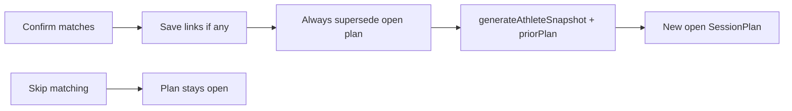

# Confirm Zero-Match Regen Implementation Plan

> **For agentic workers:** REQUIRED SUB-SKILL: Use superpowers:subagent-driven-development (recommended) or superpowers:executing-plans to implement this plan task-by-task. Steps use checkbox (`- [ ]`) syntax for tracking.

**Goal:** On Confirm in the match UI, always supersede the open plan and regenerate the athlete snapshot + next plan — including when every activity is “Not in plan.”

**Architecture:** Narrow change to `confirmMatches`: drop the `matchedCount === 0` early return and always supersede before regenerating with `priorPlan` continuity. Update `SyncActivitiesButton` so Confirm no longer claims the plan was unchanged when `matchedCount === 0`. Skip matching stays unchanged.

**Tech Stack:** Next.js App Router, Mongoose `SessionPlan` / `Activity`, existing `generateAthleteSnapshot` + `toPriorPlanSessions`.

## Global Constraints

- Spec: `docs/superpowers/specs/2026-08-11-confirm-zero-match-regen-design.md`
- Confirm always regenerates; Skip matching does not
- No automated tests (explicit non-goal)
- Do not change `syncActivities.ts` match-phase gating
- Do not change `/api/session-plans/regenerate` beyond existing retry use
- Do not commit unless the user asks

---

## File map

| File | Responsibility |
| --- | --- |
| `src/services/matching/confirmMatches.ts` | Supersede + regenerate on every successful Confirm |
| `src/components/SyncActivitiesButton.tsx` | Remove “Plan unchanged” message after Confirm with zero matches |



---

### Task 1: Always regenerate in `confirmMatches`

**Files:**
- Modify: `src/services/matching/confirmMatches.ts` (supersede gate + early return around lines 151–159)

**Interfaces:**
- Consumes: existing `confirmMatches({ userId, sessionPlanId, matches })`
- Produces: same `ConfirmMatchesResult`; zero-match success returns `{ ok: true, matchedCount: 0, regenerated: true }` instead of `regenerated: false`

- [ ] **Step 1: Always supersede the open plan on Confirm**

Replace:

```ts
  if (matchedCount >= 1) {
    plan.status = "superseded";
  }

  await plan.save();

  if (matchedCount === 0) {
    return { ok: true, matchedCount: 0, regenerated: false };
  }
```

With:

```ts
  plan.status = "superseded";

  await plan.save();
```

Leave the existing `try { await generateAthleteSnapshot(...) }` block, newer-open-plan check, and success return unchanged so zero-match Confirm follows the same regen path as matched Confirm.

- [ ] **Step 2: Sanity-check types**

Run:

```bash
npx tsc --noEmit
```

Expected: no new errors from `confirmMatches.ts`.

- [ ] **Step 3: Manual logic check (no automated test)**

Mentally verify:

1. Confirm with all `sessionOrder: null` → plan superseded → snapshot/plan regen → `{ ok: true, matchedCount: 0, regenerated: true }` when a newer open plan exists.
2. Confirm with at least one match → same as before (supersede + regen).
3. Regen failure still returns `{ ok: false, matchesSaved: true, error: "plan_regen_failed", matchedCount }`.

---

### Task 2: Update Confirm success UI copy

**Files:**
- Modify: `src/components/SyncActivitiesButton.tsx` (inside `handleConfirm`, ~lines 167–170)

**Interfaces:**
- Consumes: confirm API still returns `matchedCount` / `regenerated` / `plan_regen_failed`
- Produces: successful Confirm clears match UI and refreshes without claiming the plan was unchanged

- [ ] **Step 1: Remove the zero-match “Plan unchanged” message**

Replace:

```tsx
      setMatchPhase(null)
      if (data.matchedCount === 0) {
        setMessage("Activities saved. Plan unchanged.")
      }
      router.refresh()
```

With:

```tsx
      setMatchPhase(null)
      router.refresh()
```

Do **not** change `handleSkipMatching` — it must still set `setMessage("Activities saved. Plan unchanged.")`.

Do **not** change the `plan_regen_failed` / `needsRegenRetry` path.

- [ ] **Step 2: Typecheck**

Run:

```bash
npx tsc --noEmit
```

Expected: clean (or no new errors in touched files).

- [ ] **Step 3: Manual verification**

1. Sync so the match UI appears.
2. Leave every activity as “Not in plan” → Confirm → open plan is replaced by a new plan (home / progress reflects adapted week); no “Plan unchanged” toast.
3. Sync again → Skip matching → message “Activities saved. Plan unchanged.” and the open plan is untouched.
4. Optional: Confirm with one real match still regenerates as before; if regen fails, Retry generate plan still works.

---

## Spec coverage (self-review)

| Spec requirement | Task |
| --- | --- |
| Confirm with zero matches supersedes + regenerates | Task 1 |
| `priorPlan` continuity from superseded plan | Task 1 (existing regen path) |
| Same `plan_regen_failed` contract | Task 1 (unchanged error path) |
| UI: no “Plan unchanged” after zero-match Confirm | Task 2 |
| Skip matching unchanged | Task 2 (explicit non-edit) |
| No `syncActivities.ts` change | (out of scope) |
| No automated tests | (global constraint) |
