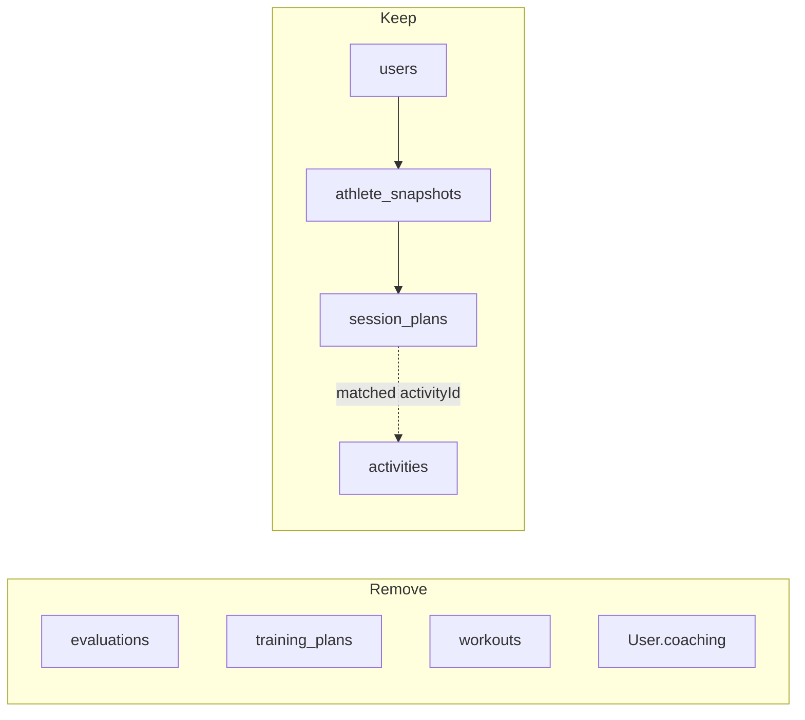

# Remove Unused Evaluation / TrainingPlan / Workout Collections Implementation Plan

> **For agentic workers:** REQUIRED SUB-SKILL: Use superpowers:subagent-driven-development (recommended) or superpowers:executing-plans to implement this plan task-by-task. Steps use checkbox (`- [ ]`) syntax for tracking.

**Goal:** Delete the unused Mongoose collections `evaluations`, `training_plans`, and `workouts` (models, User pointers, and the profile “Current plan” UI that reads a never-written TrainingPlan).

**Architecture:** Coaching today uses `AthleteSnapshot` + `SessionPlan` + `DailyCoachMessage`. The original Evaluation → TrainingPlan → Workout chain was never implemented: no service creates or updates those documents. Remove the dead models, the unused `User.coaching` subdocument, and the profile card that would only render if a TrainingPlan existed. Leave historical design notes in `docs/ai-running-coach-data-model.md` as history; update the live entity doc.

**Tech Stack:** Next.js App Router, Mongoose 9, Chakra UI profile page, colocated `node:assert/strict` tests run with `npx tsx`.

## Global Constraints

- Do not commit unless the user asks
- Do not rewrite `docs/ai-running-coach-data-model.md` (historical design); only add a one-line note that those collections were never used
- Do not change `SessionPlan`, `AthleteSnapshot`, `Activity`, or `DailyCoachMessage`
- Do not add a migration framework; optional Mongo drop is a one-off mongosh command
- Keep `heartRateSchema` / `IHeartRate` (used by Activity)
- Do not drop `users` fields other than `coaching`

---

## Audit (why this is safe)

| Collection | Create | Update | Read |
| --- | --- | --- | --- |
| `evaluations` | none | none | none (model + `User.coaching.currentEvaluationId` ref only) |
| `workouts` | none | none | none (model only) |
| `training_plans` | none | none | one dead read: `TrainingPlan.findById` in `getProfileView` when `user.coaching.currentTrainingPlanId` is set |

Nothing in the app ever writes `currentEvaluationId` or `currentTrainingPlanId`. User insert in `src/auth.ts` only sets `coaching: {}`. The profile “Current plan” card is therefore unreachable in production unless someone inserted documents by hand.

Live replacements: `AthleteSnapshot` (athlete state) and `SessionPlan` / `IPlannedSession` (prescribed sessions).

## File map

| File | Responsibility |
| --- | --- |
| Delete `src/models/Evaluation.ts` | Unused `evaluations` model |
| Delete `src/models/TrainingPlan.ts` | Unused `training_plans` model |
| Delete `src/models/Workout.ts` | Unused `workouts` model |
| Delete `src/components/profile/ProfileCurrentPlanCard.tsx` | UI that would show a TrainingPlan |
| Modify `src/models/index.ts` | Stop exporting deleted models and unused shared types |
| Modify `src/models/shared.ts` | Drop workout/plan enums and Evaluation-only metrics schemas |
| Modify `src/models/User.ts` | Drop entire `coaching` subdocument |
| Modify `src/auth.ts` | Stop `$setOnInsert` of `coaching: {}` |
| Modify `src/services/profile/types.ts` | Drop `currentPlan` / `ProfilePlanInput` / `TrainingPlanStatus` |
| Modify `src/services/profile/getProfileView.ts` | Stop loading TrainingPlan; drop plan mapping |
| Modify `src/services/profile/getProfileView.test.ts` | Assert no current-plan field |
| Modify `src/app/profile/page.tsx` | Stop rendering `ProfileCurrentPlanCard` |
| Modify `docs/entities/README.md` | Live model doc matches remaining collections |
| Modify `docs/ai-running-coach-data-model.md` | One historical note at the top |



---

### Task 1: Remove profile “Current plan” (the only TrainingPlan read)

**Files:**
- Modify: `src/services/profile/getProfileView.test.ts`
- Modify: `src/services/profile/types.ts`
- Modify: `src/services/profile/getProfileView.ts`
- Modify: `src/app/profile/page.tsx`
- Delete: `src/components/profile/ProfileCurrentPlanCard.tsx`

**Interfaces:**
- Consumes: `mapUserToProfileView({ user })` (no `currentPlan` argument)
- Produces: `ProfileView` without `currentPlan`; `getProfileView` no longer queries `TrainingPlan`

- [ ] **Step 1: Change tests to the desired API**

In `src/services/profile/getProfileView.test.ts`:

1. Delete the entire `testAttachesCurrentPlan` function and its call at the bottom.
2. In `testMapsPresetGoalAndWeekTemplate`, replace `assert.equal(view.currentPlan, null);` with:

```ts
  assert.equal("currentPlan" in view, false);
```

3. Add this test (and call it with the others):

```ts
function testDoesNotAcceptCurrentPlanInput() {
  const view = mapUserToProfileView({ user: baseUser });
  assert.equal("currentPlan" in view, false);
}
```

- [ ] **Step 2: Run tests and confirm they fail**

Run:

```bash
npx tsx src/services/profile/getProfileView.test.ts
```

Expected: FAIL — `currentPlan` is still on `ProfileView` (`"currentPlan" in view` is `true`), and `testAttachesCurrentPlan` is gone so the remaining assertion is the one that fails.

- [ ] **Step 3: Strip current-plan types**

In `src/services/profile/types.ts`, remove:

- `import type { TrainingPlanStatus } from "@/models";`
- `ProfileCurrentPlanView`
- `currentPlan: ProfileCurrentPlanView | null;` from `ProfileView`
- `ProfilePlanInput`

`ProfileView` after the change:

```ts
export type ProfileView = {
  name: string;
  email: string;
  memberSince: string;
  memberSinceLabel: string;
  goal: ProfileGoalView | null;
  trainingMethod: ProfileTrainingMethodView;
  athlete: ProfileAthleteView;
};
```

- [ ] **Step 4: Strip current-plan loading and mapping**

In `src/services/profile/getProfileView.ts`:

- Remove `TrainingPlan` and `TrainingPlanStatus` from the `@/models` import (keep nothing from models if unused; this file will import only `User` from `@/models`).
- Remove `Types` import from mongoose.
- Remove `ProfileCurrentPlanView` and `ProfilePlanInput` from the `./types` import.
- Delete `PLAN_STATUS_LABELS`.
- Delete `mapCurrentPlan`.
- Change `mapUserToProfileView` to take only `{ user: ProfileUserInput }` and drop `currentPlan: mapCurrentPlan(...)`.
- Change `getProfileView` so it no longer reads `coaching.currentTrainingPlanId` or `TrainingPlan.findById`.

`getProfileView` after the change:

```ts
const USER_PROFILE_SELECT =
  "profile goal trainingStyle createdAt" as const;

export async function getProfileView(
  userId: Types.ObjectId | string,
  now: Date = new Date(),
): Promise<ProfileView | null> {
  await dbConnect();
  const user = await User.findById(userId)
    .select(USER_PROFILE_SELECT)
    .lean<ProfileUserInput | null>();
  if (!user) return null;

  return mapUserToProfileView({ user }, now);
}
```

Keep `import type { Types } from "mongoose"` only if `userId` still uses `Types.ObjectId`. It does — leave that import.

`mapUserToProfileView` signature after the change:

```ts
export function mapUserToProfileView(
  input: { user: ProfileUserInput },
  now: Date = new Date(),
): ProfileView {
```

And the return object must not include `currentPlan`.

- [ ] **Step 5: Remove the profile card**

In `src/app/profile/page.tsx`, remove the `ProfileCurrentPlanCard` import and this block:

```tsx
        {profile.currentPlan ? (
          <ProfileCurrentPlanCard plan={profile.currentPlan} />
        ) : null}
```

Delete `src/components/profile/ProfileCurrentPlanCard.tsx`.

- [ ] **Step 6: Run tests and typecheck**

```bash
npx tsx src/services/profile/getProfileView.test.ts
npx tsc --noEmit
```

Expected: both pass. `tsc` may still fail on unused `TrainingPlan` exports until Task 2; if the only errors are unused-model related in files you have not touched yet, that is fine. `getProfileView.test.ts` must pass.

---

### Task 2: Delete models, User.coaching, and unused shared types

**Files:**
- Delete: `src/models/Evaluation.ts`
- Delete: `src/models/TrainingPlan.ts`
- Delete: `src/models/Workout.ts`
- Modify: `src/models/index.ts`
- Modify: `src/models/shared.ts`
- Modify: `src/models/User.ts`
- Modify: `src/auth.ts`

**Interfaces:**
- Consumes: Task 1 (no remaining `TrainingPlan` / `TrainingPlanStatus` imports)
- Produces: barrel no longer exports `Evaluation`, `TrainingPlan`, `Workout`, `IUserCoaching`, workout/plan enums, or Evaluation-only metrics schemas; `IUser` has no `coaching`

- [ ] **Step 1: Delete the three model files**

Delete:

- `src/models/Evaluation.ts`
- `src/models/TrainingPlan.ts`
- `src/models/Workout.ts`

- [ ] **Step 2: Slim `src/models/shared.ts`**

Remove `WORKOUT_TYPES`, `WorkoutType`, `WORKOUT_STATUSES`, `WorkoutStatus`, `TRAINING_PLAN_STATUSES`, `TrainingPlanStatus`, `IEstimatedRaceTimes`, `IAthleteMetrics`, `estimatedRaceTimesSchema`, and `athleteMetricsSchema`.

Keep `ACTIVITY_*`, `SESSION_TYPES`, `SEGMENT_KINDS`, `IHeartRate`, and `heartRateSchema`.

Full file after the change:

```ts
import { Schema } from "mongoose";
import {
  GOAL_DISTANCE_KM,
  GOAL_TYPES,
  type GoalType,
} from "@/lib/goal";

export {
  GOAL_DISTANCE_KM,
  GOAL_TYPES,
  type GoalType,
};

export const ACTIVITY_TYPES = ["run", "walk"] as const;
export type ActivityType = (typeof ACTIVITY_TYPES)[number];

export const ACTIVITY_SOURCES = ["strava"] as const;
export type ActivitySource = (typeof ACTIVITY_SOURCES)[number];

export const SESSION_TYPES = [
  "easy",
  "tempo",
  "long_run",
  "interval",
  "recovery",
  "rest",
] as const;
export type SessionType = (typeof SESSION_TYPES)[number];

export const SEGMENT_KINDS = [
  "warmup",
  "work",
  "rest",
  "cooldown",
  "steady",
] as const;
export type SegmentKind = (typeof SEGMENT_KINDS)[number];

export interface IHeartRate {
  average?: number;
  max?: number;
}

export const heartRateSchema = new Schema<IHeartRate>(
  {
    average: { type: Number },
    max: { type: Number },
  },
  { _id: false },
);
```

- [ ] **Step 3: Remove `coaching` from `User`**

In `src/models/User.ts`:

- Change the mongoose import to drop `Types` (only used by coaching ObjectIds):

```ts
import mongoose, { Schema, type HydratedDocument, type Model } from "mongoose";
```

- Delete `IUserCoaching` entirely.
- Remove `coaching: IUserCoaching;` from `IUser`.
- Delete `userCoachingSchema`.
- Remove the `coaching` field from `UserSchema` (the `required` + `default: () => ({})` block).

`IUser` after the change:

```ts
export interface IUser {
  strava: IUserStrava;
  profile: IUserProfile;
  goal?: IUserGoal;
  /** Missing on legacy users — treat as adaptive at snapshot time. */
  trainingStyle?: TrainingStyle;
  createdAt: Date;
  updatedAt: Date;
}
```

`UserSchema` fields after the change:

```ts
const UserSchema = new Schema<IUser>(
  {
    strava: { type: userStravaSchema, required: true },
    profile: { type: userProfileSchema, required: true },
    goal: { type: userGoalSchema },
    trainingStyle: { type: String, enum: TRAINING_STYLES },
  },
  {
    timestamps: true,
    collection: "users",
  },
);
```

Mongoose strict mode ignores leftover `coaching` on existing documents; no app-side `$unset` is required for correctness.

- [ ] **Step 4: Stop inserting `coaching` on signup**

In `src/auth.ts`, change `$setOnInsert` to only set the athlete id:

```ts
          $setOnInsert: {
            "strava.athleteId": athleteId,
          },
```

- [ ] **Step 5: Slim the barrel**

Replace the `from "./shared"` and User/Evaluation/TrainingPlan/Workout export blocks in `src/models/index.ts` with:

```ts
export {
  ACTIVITY_SOURCES,
  ACTIVITY_TYPES,
  GOAL_DISTANCE_KM,
  GOAL_TYPES,
  SEGMENT_KINDS,
  SESSION_TYPES,
  heartRateSchema,
  type ActivitySource,
  type ActivityType,
  type GoalType,
  type IHeartRate,
  type SegmentKind,
  type SessionType,
} from "./shared";

export {
  User,
  TRAINING_STYLES,
  type IUser,
  type IUserGoal,
  type IUserProfile,
  type IUserStrava,
  type TrainingStyle,
  type UserDocument,
} from "./User";
```

Delete these blocks entirely (do not leave comments):

```ts
export {
  Evaluation,
  type EvaluationDocument,
  type IEvaluation,
  type IEvaluationAnalysis,
  type IEvaluationPeriod,
  type IGoalAssessment,
} from "./Evaluation";

export {
  TrainingPlan,
  type ITrainingPlan,
  type TrainingPlanDocument,
} from "./TrainingPlan";

export {
  Workout,
  type IWorkout,
  type IWorkoutTarget,
  type WorkoutDocument,
} from "./Workout";
```

Keep the Activity, AthleteSnapshot, SessionPlan, and DailyCoachMessage export blocks unchanged.

- [ ] **Step 6: Verify no remaining references and typecheck**

```bash
rg -n "Evaluation|TrainingPlan|Workout|IUserCoaching|IAthleteMetrics|WORKOUT_TYPES|TRAINING_PLAN_STATUSES|currentTrainingPlanId|currentEvaluationId" --glob '!docs/**' --glob '!node_modules/**'
npx tsc --noEmit
npx tsx src/services/profile/getProfileView.test.ts
```

Expected:

- `rg` matches only inside deleted-file remnants if any remain; there must be **zero** matches under `src/` after the deletes. Historical mentions in `docs/` are allowed until Task 3.
- `tsc --noEmit` exits 0.
- Profile tests pass.

If `rg` still finds `src/models/Evaluation.ts` etc., the delete step was missed.

---

### Task 3: Update live docs; optional Mongo drop

**Files:**
- Modify: `docs/entities/README.md`
- Modify: `docs/ai-running-coach-data-model.md` (first paragraph only)

**Interfaces:**
- Consumes: Task 2 collection/model names
- Produces: entity README that lists only live collections; historical data-model doc marked as superseded for these three

- [ ] **Step 1: Update `docs/entities/README.md`**

Layout tree — replace Evaluation/TrainingPlan/Workout with the live files:

```text
src/models/
  shared.ts          # enums, GOAL_DISTANCE_KM, heartRateSchema
  User.ts
  Activity.ts
  AthleteSnapshot.ts
  SessionPlan.ts
  DailyCoachMessage.ts
  index.ts           # barrel re-exports
```

Conventions collections line:

```text
- **Collections:** `users`, `activities`, `athlete_snapshots`, `session_plans`, `daily_coach_messages` (explicit `collection` option)
```

Timestamps line — drop Evaluation/TrainingPlan/Workout:

```text
- **Timestamps:** `timestamps: true` on User and Activity; `createdAt` only (`updatedAt: false`) on AthleteSnapshot, SessionPlan, and DailyCoachMessage
```

User section: change “and coaching pointers” to “and training style”. Delete the `coaching:` bullet.

Delete the entire `### Evaluation`, `### TrainingPlan`, and `### Workout` sections.

Relationships — replace with the live graph (do not invent fields; this is documentation of existing models):

```text
User
 ├── Activities
 ├── AthleteSnapshots
 ├── SessionPlans
 └── DailyCoachMessages

AthleteSnapshot ──feeds──► SessionPlan ──sessions match──► Activity
```

Shared module bullet list — replace WorkoutType / athleteMetrics with:

```text
- Enum const arrays and union types (`GoalType`, `ActivityType`, `SessionType`, `SegmentKind`)
- `GOAL_DISTANCE_KM`
- Reusable schemas: `heartRateSchema`
```

Out of scope: delete the “Evaluation immutability middleware” bullet.

Do not add full AthleteSnapshot / SessionPlan field lists in this task unless they already exist elsewhere in the file; the goal is to stop documenting deleted collections.

- [ ] **Step 2: Add a historical note to the original data-model doc**

At the top of `docs/ai-running-coach-data-model.md`, immediately after the title (before the rest of the original content), add:

```markdown
> **Status (2026-08-18):** Collections `evaluations`, `training_plans`, and `workouts` were designed here but never created, updated, or read in application code. Live coaching uses `AthleteSnapshot` and `SessionPlan` instead. This document is historical.
```

Do not rewrite the rest of that file.

- [ ] **Step 3: Optional MongoDB drop (manual, after code is deployed)**

Only if those collections exist in the database. Using the app’s `MONGODB_URI`:

```bash
mongosh "$MONGODB_URI" --eval 'db.evaluations.drop(); db.training_plans.drop(); db.workouts.drop(); db.users.updateMany({}, { $unset: { coaching: "" } })'
```

Expected: `drop()` returns `true` if the collection existed, `false` if it did not. The `$unset` removes leftover `coaching` from user documents.

Do **not** put this command in application startup.

- [ ] **Step 4: Final verification**

```bash
npx tsc --noEmit
npx tsx src/services/profile/getProfileView.test.ts
rg -n 'collection: "(evaluations|training_plans|workouts)"' src
```

Expected: `tsc` and tests pass; `rg` prints no matches.
